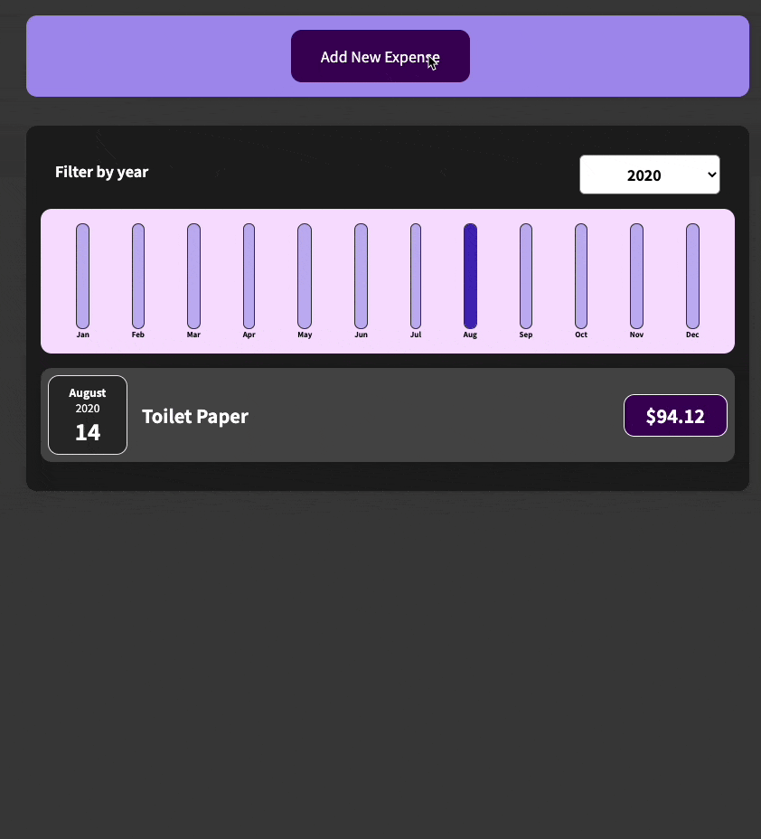
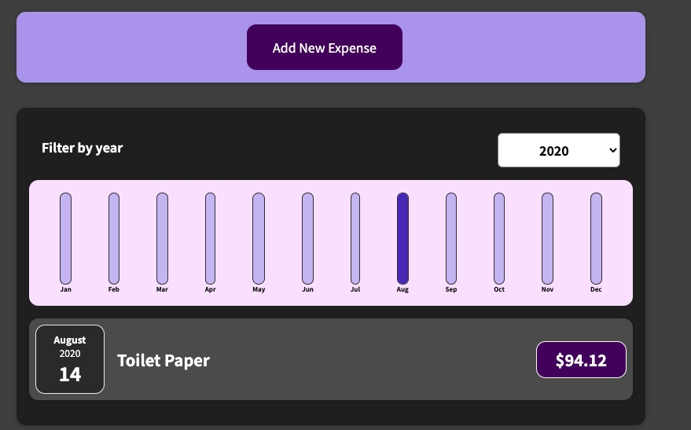
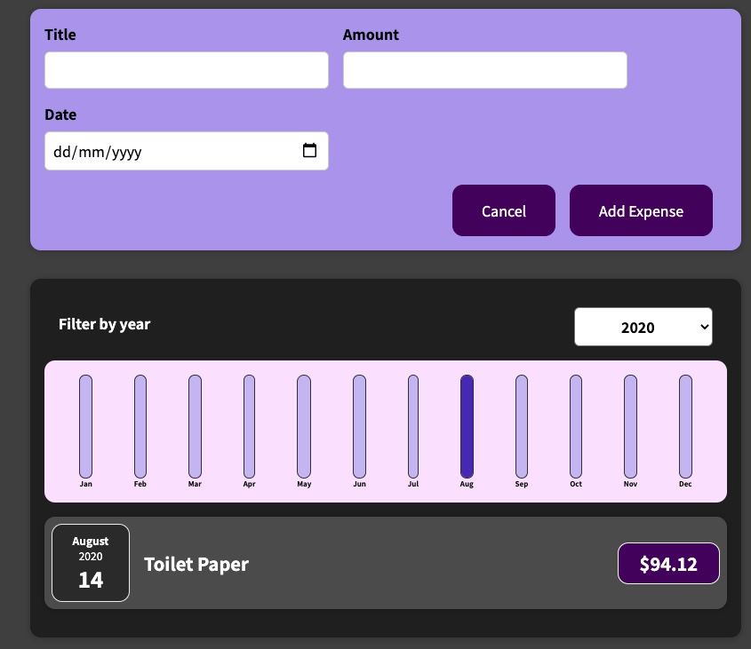
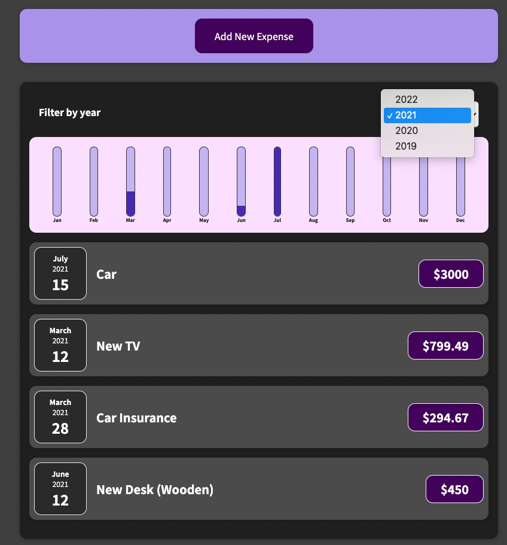

# Expense Tracker

***The project I've built by following a Udemy React course***. 

### Description 
In this project, I've learnt how to create reusable components and how to design a page with thinking of reusability and flexibility. 

For connecting the components and passing data between components, `setState` in `Hooks` has been adopted in this project which also means `Funtional Components` are used instead of `Class Components`.

### Demo

  

| Home | Add | Date |
| :---: | :---: | :---:|
|| ||